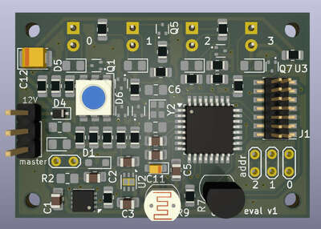

# LIN evaluation board for embassy
LIN eval board utilizing the Rust Embassy framework, featuring:
- 4x LEDs
- 1x RGB LED
- 1x Photoresistor for light sensing
- 1x One-Wire DS18B20 temperature sensor
- 3x jumpers to set board ID (0-7)




## Build and run

Connect debugger and run:

```shell-session
$ cargo run
```

To initiate LIN communication, connect the PEAK PLIN-USB interface and run the following command:
```shell-session
$ uv run ./commander.py
```
